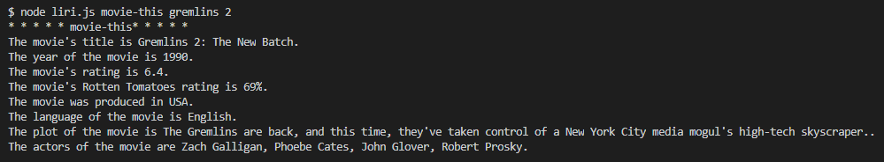
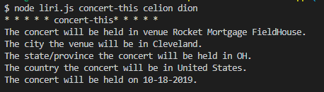
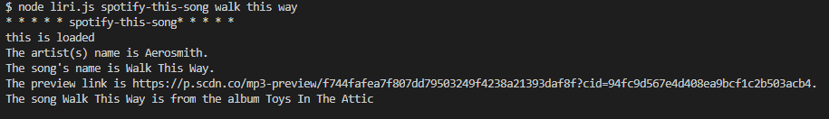
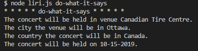

# liri-node-app
LIRI: Language Interpretation and Recognition Interface. This application will take a command line prompt and give you back API data from Spotify, Band in Town, or OMDB.

## Contributor(s)
  * This application was created by `Ivor Wallace`.

## Instructions
The user will type in `node liri.js` and one of four actions from a comand line.
  * concert-this `artist/band name`
  * spotify-this-song `song name`
  * movie-this `movie name`
  * do-what-it-says
  

### Packages needed:
  * axios
  * spotify
  * momemt
  * dotenv

### Retrieve movie

* Sample API call: <http://www.omdbapi.com/?t=Mr.Nobody&apikey=sample>.

* If the movie is empty, then `Mr. Nobody` will be used as the default movie to retrieve data.

* After getting the JSON response from the HTTP request, create a string containing the following information from the returned show data:

  * The title of the movie
  * The year of the movie
  * The Rotten Tomatoes rating
  * The country the movie was produced in
  * The language the movie
  * The plot of the movie
  * The actors in the movie

* Save this string to the `output.txt` file using the `fs.appendFile` method. If the file does not already exist, `fs.appendFile` will create it.

* After saving the data to the `output.txt` file, print this information to the console.

* 

### Retrieve concert

* Sample api call: <https://rest.bandsintown.com/artists/Celine+Dion/events?app_id=sample>
  
* Save the following information to the `output.txt` file using the `fs.appendFile` method:

  * The venue name where the concert wil be held
  * The city of the venue
  * The state or province of the concert `(if applicable)`
  * The country of the concert
  * The date of the concert `formatted to MM-DD-YYYY with moment`

* Save the return data to the `output.txt` file using the `fs.appendFile` method. If the file does not already exist, `fs.appendFile` will create it.

* After saving the data to the `output.txt` file, print this information to the console.

* 

### Retrieve song

* Sample api call: `spotify.search({ type: 'track', query: 'The Sign' })`

* If the song is empty, then `The Sign` will be used as the default song to retrieve data.
  
* Save the following information to the `output.txt` file using the `fs.appendFile` method:

  * The name of the artist
  * The name of the song
  * The preview URL
  * The name of the album the song is from
  
* Save the return data to the `output.txt` file using the `fs.appendFile` method. If the file does not already exist, `fs.appendFile` will create it.

* After saving the data to the `output.txt` file, print this information to the console.

* 

### Retrieve do as it says
 
* Read the following information from the `random.txt` file using the `fs.appendFile` method:

  * One of the following commands `concert-this, movie-this, spotify-this-song`.
  * The name of the query in `quotes`.

* The contents of `ramdom.txt` will simulate a command line entry and execute an API call that will return a `movie, song, or concert` data.
  
* Save the return data to the `output.txt` file using the `fs.appendFile` method. If the file does not already exist, `fs.appendFile` will create it.

* After saving the data to the `output.txt` file, print this information to the console.

* 